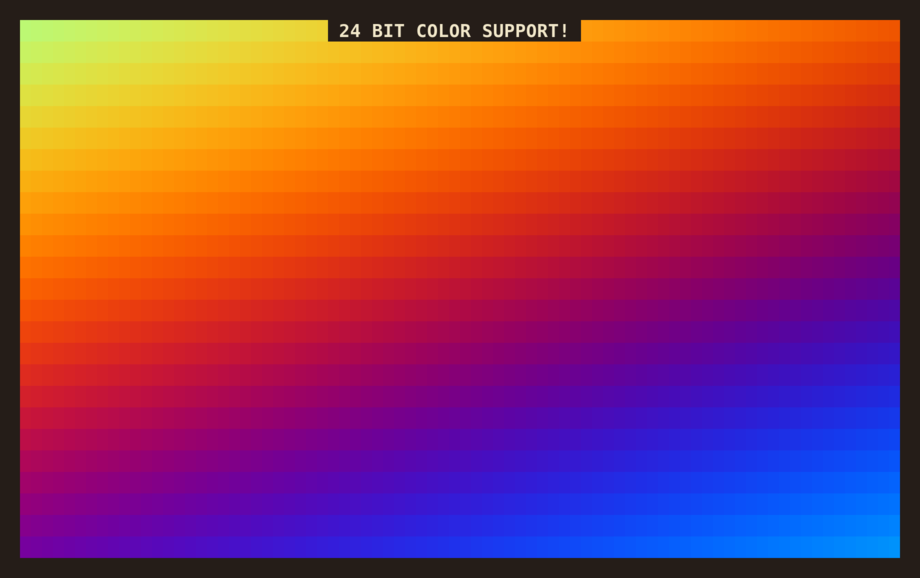

# BTUI - Bruce's Text User Interface Library

BTUI is a minimal, embeddable single header file alternative to bloatware like
ncurses. BTUI aims to be less than 1% the size of ncurses, while also providing
a better API for the programmer who is not afraid to roll up their sleeves and
manage their own state. If you want a drop-in TUI library that lets you switch
into TUI mode, write some strings to the screen with 24-bit color, and get user
keypresses, then this is the library for you!

Note: Currently, BTUI is somewhere between 0.5% and 0.1% the size of ncurses,
but even *counting the number of lines of code in ncurses* is hard.

## Cleanup by Default

Once BTUI is enabled, you can manually disable TUI Mode (e.g. if you want to
temporarily drop back to the regular shell). However, BTUI will always
automatically put the terminal back in a normal state when your program exits,
even in the event of a segfault or other blockable signal. BTUI can't do
anything about unblockable signals like SIGKILL though, so don't use `killall
-9 myprog` unless you want a gunked up terminal, just use `kill myprog`
instead. If your terminal *does* get gunked up, you can always run the `reset`
shell command to reset it.

## Easy 24-bit Colors

BTUI supports 24-bit colors. It's dead easy, just `btui_set_fg(bt, r, g, b)`
(foreground color) or `btui_set_bg(bt, r, g, b)` (background color). Try `make
rainbow` to see a demo of 24-bit colors in action. This has been supported by
most terminals for aeons, but most TUI applications still default to using the
same 8 colors. It doesn't have to be that way! (Although you can still use
those colors with `btui_set_attributes(bt, BTUI_BG_RED | BTUI_FG_BLACK)` and so
forth.)

## User Input

BTUI lets you get keyboard input for all keypress events handled by your
terminal, including mouse clicking and dragging. Warning: BTUI also hooks in to
`Ctrl-c`, `Ctrl-d`, `Ctrl-z`, and other keyboard events that normally have very
specific behavior in terminal programs. If you want that specific behavior,
then you'll have to implement it manually. The upside is that you're able to
handle it gracefully and do whatever cleanup you want. If you want to provide
`Ctrl-z` suspend functionality, you can use `btui_suspend(bt)`.

Warning: xterm control sequences do not support all key combinations (e.g.
`Ctrl-9`) and some key combinations map to the same control sequences (e.g.
`Ctrl-m` and `Enter`, or `Ctrl-8` and `Backspace`). `Escape` in particular is a
little bit odd, since it's only recognized as an escape keypress if some amount
of time has passed after pressing it with no new bytes being sent. Most of this
oddity is completely unavoidable, that's just the how terminals work. Escape
key handling can be improved slightly by polling with zero timeout.

## Tips and Tricks

* For best performance, try to structure your program to take advantage of
  terminal scrolling. It's much faster than redrawing every line on the screen.

* Don't assume a string's length (in bytes) is the same as its width on the
  screen. Unicode characters and terminal escape sequences violate this
  assumption.

* Don't clear the screen unless you need to. It causes a lot of unnecessary
  redrawing.

* A good pattern to follow is: draw things from left to right, clearing to the
  right after each item. Then, once everything has been drawn, clear to the
  bottom of the screen. If you follow this approach, you won't have to worry
  too much about the screen width of the things you're writing. Also, the
  terminal won't flicker, since you're never blanking the whole screen, only
  part of a line at a time.

* Text wrapping must be done manually, since many terminals do not support
  wrapping around to any point other than the first column, which is useless
  for any TUI uses other than text on the far left of the screen.

## Language Bindings

BTUI comes with bindings for C and Lua, with plans to add Python bindings.

### C API

BTUI has the following C function definitions, as well as definitions for some
constants, including terminal escape values and keycodes.

    btui_t* btui_enable(void);
    void btui_disable(btui_t *bt);
    int btui_getkey(btui_t *bt, int timeout, int *mouse_x, int *mouse_y);
    int btui_move_cursor(btui_t *bt, int x, int y);
    char *btui_keyname(int key, char *buf);
    int btui_keynamed(const char *name);
    int btui_set_attributes(btui_t *bt, attr_t attrs);
    int btui_set_fg(btui_t *bt, unsigned char r, unsigned char g, unsigned char b);
    int btui_set_bg(btui_t *bt, unsigned char r, unsigned char g, unsigned char b);
    int btui_set_fg_hex(btui_t *bt, int hex);
    int btui_set_bg_hex(btui_t *bt, int hex);
    #define btui_printf(bt, ...) fprintf((bt)->out, __VA_ARGS__)
    #define btui_puts(bt, s) fputs(s, (bt)->out)
    #define btui_flush(bt) fflush((bt)->out)
    #define btui_clear_below(bt) fputs("\033[J", (bt)->out)
    #define btui_clear_above(bt) fputs("\033[1J", (bt)->out)
    #define btui_clear_screen(bt) fputs("\033[2J", (bt)->out)
    #define btui_clear_right(bt) fputs("\033[K", (bt)->out)
    #define btui_clear_left(bt) fputs("\033[1K", (bt)->out)
    #define btui_clear_line(bt) fputs("\033[2K", (bt)->out)
    #define btui_suspend(bt) kill(getpid(), SIGTSTP)
    void btui_draw_linebox(btui_t *bt, int x, int y, int w, int h);
    void btui_fill_box(btui_t *bt, int x, int y, int w, int h);
    void btui_draw_shadow(btui_t *bt, int x, int y, int w, int h);

See [C/test.c](C/test.c) for example usage.

### Lua API

The Lua library returns a function that takes one argument: a function that will
be called with a `BTUI` object, which can be used to do TUI actions. Errors will
be propagated out of the function, but the terminal will be cleaned up nicely
before the error is printed. Here's a simple example program:

    require("btui")(function(bt)
        -- Run this code within the TUI, using "bt" as the TUI object
        ...
    end)

    bt:enable() -- Enables btui (if previously disabled)
    bt:disable() -- Disables btui
    bt:withdisabled(fn) -- Calls "fn" with btui disabled, then re-enables btui
    bt:getkey(timeout=-1) -- Returns a keypress (and optionally, mouse x and y coordinates). The optional timeout argument specifies how long, in tenths of a second, to wait for the next keypress.
    bt:print() -- Print text to the terminal
    bt:clear(type="screen") -- Clear the terminal. Options are: "screen", "right", "left", "above", "below", "line"
    bt:flush() -- Flush the terminal output. Most operations do this anyways.
    bt:move(x, y) -- Move the cursor to the given position. (0,0) is the top left corner.
    -- R,G,B values are in the range [0.0, 1.0]:
    bt:withfg(r,g,b, fn) -- Set the foreground color to (r,g,b), call fn, then reset the foreground color to default
    bt:withbg(r,g,b, fn) -- Set the background color to (r,g,b), call fn, then reset the background color to default
    bt:linebox(x,y,w,h) -- Draw an outlined box around the given rectangle
    bt:fillbox(x,y,w,h) -- Fill the given rectangle with space characters
    bt:shadow(x,y,w,h) -- Draw a shaded shadow to the bottom right of the given rectangle
    bt:withattributes(attrs..., fn) -- Set the given attributes, call fn, then unset them
    bt:setattributes(attrs...) -- Set the given attributes
    bt:unsetattributes(attrs...) -- Unset the given attributes
    bt:suspend() -- Suspend the current process and drop back into normal terminal mode
    bt:width() -- Return the scren width
    bt:height() -- Return the screen height

See [Lua/test.lua](Lua/test.lua) for example usage.

### Python API

Coming soon.

## FAQ

### Why not use ncurses? It's already installed almost everywhere!

[Ncurses](https://invisible-island.net/ncurses/) is pretty ubiquitous among
amateur TUI developers, however it's a really messy paradigm to work with, and
it comes with hundreds of thousands of lines of code bloat. There's also tons
of compatibility problems across different versions of ncurses. Using ncurses
is a headache, and writing a wrapper around ncurses just adds more bloat on top
of a mountain of bloat. So, if you want to write a really nice TUI library for
your language of choice, BTUI is a good option for a foundation to build off
of. BTUI handles all the low-level C stuff like setting terminal attributes and
interrupt handlers, but after that, it mostly just gets out of the way and lets
you write the bytes you want, with just a few helper functions that make
writing the right bytes easy.

### Why not use termbox?

[Termbox](https://github.com/nsf/termbox) is an okay library, but its API is
built around modifying terminal cells one-at-a-time using function calls. This
approach has two major flaws: it's very bad for performance and it makes the
API very awkward to use if you want to write strings to the screen. Termbox
uses its own custom internal write-buffering to reduce write calls and help
performance, but in my experience, there is still noticeable lag when doing
large amounts of writes compared to just using plain ol' C `fprintf()`
buffering.

Also, termbox is intended to be used as a system-installed library, but BTUI is
much simpler to use: just drop the .h file into your project and `#import
"btui.h"`!

## License

BTUI is released under the MIT license. See [LICENSE](LICENSE) for details.
